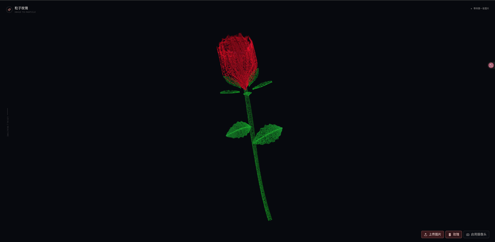
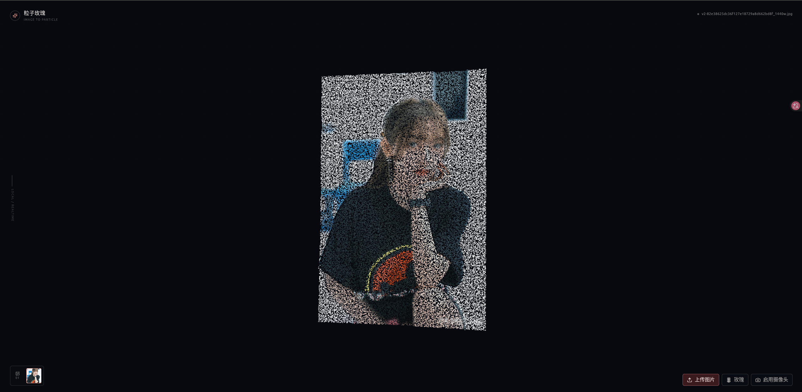

# 粒子玫瑰

一个完全运行在浏览器本地的 3D 粒子艺术工具：上传图片后生成可旋转的 3D 浮雕粒子，并可以重组为带红色花冠、绿色花萼、花茎和叶片的程序化玫瑰。

## 功能

- 支持 JPG、PNG 和 WebP 图片，最多 12 张，单张不超过 10 MB。
- 图片在浏览器本地解码和采样，不会上传到服务器。
- 图片粒子保留原始宽高比、颜色和轻量 3D 厚度。
- 玫瑰使用纯粒子点云生成，不依赖 GLTF 或实体花瓣模型。
- 支持图片队列、缩略图切换、图片删除和玫瑰形态切换。
- 支持鼠标拖拽、滚轮、移动端单指旋转和双指缩放。
- 支持 MediaPipe 手势：掌心控制旋转，捏合控制缩放，张合控制粒子聚散，左右挥手切换图片。
- 摄像头或手势不可用时自动回退到鼠标和触摸控制。

## 效果截图

玫瑰粒子形态：



图片粒子浮雕：



## 技术栈

- React 18
- TypeScript
- Vite
- Three.js
- MediaPipe Tasks Vision

## 本地运行

```bash
npm install
npm run dev
```

然后打开终端显示的本地地址。摄像头手势需要在 `localhost` 或 HTTPS 环境下主动授权。

## 一键启动与关闭

在 Linux 桌面环境中，可以双击以下启动器：

- `particle-rose-start.desktop`：启动 Vite 服务，等待 `5174` 端口就绪后打开 Chrome。
- `particle-rose-stop.desktop`：停止启动器创建的 Vite 进程组。

也可以直接运行：

```bash
./start-particle-rose.sh
./stop-particle-rose.sh
```

启动脚本默认使用 `http://localhost:5174/`。端口被占用时，可指定其他端口：

```bash
PARTICLE_ROSE_PORT=5175 ./start-particle-rose.sh
```

在 Windows 中，双击以下脚本即可使用：

- `start-particle-rose.bat`：启动 Vite 服务，等待 `5174` 端口就绪后打开 Chrome（未安装 Chrome 时使用系统默认浏览器）。
- `stop-particle-rose.bat`：停止该启动脚本创建的 Vite 进程树。

Windows 脚本需要已安装 Node.js/npm，并使用 PowerShell 执行；脚本仅针对记录在 `.particle-rose.pid` 中的项目进程。启动日志保存在 `.particle-rose.log`，错误日志保存在 `.particle-rose.error.log`。

运行中的 PID 保存在 `.particle-rose.pid`。这些运行时文件不会提交到 Git。

## 手势和交互

| 操作 | 效果 |
| --- | --- |
| 掌心左右移动 | 旋转玫瑰或图片的偏航角 |
| 掌心上下移动 | 控制俯仰角 |
| 拇指和食指捏合 | 控制整体缩放 |
| 张开或收拢手掌 | 控制粒子散开或聚拢 |
| 开放手掌快速左右挥动 | 切换图片 |
| 鼠标拖拽 / 移动端单指拖拽 | 手动旋转 |
| 鼠标滚轮 / 移动端双指 | 缩放 |

## 项目结构

```text
src/particle    Three.js 粒子舞台、目标插值和 Shader
src/rose        程序化 3D 玫瑰点云
src/image       图片解码、采样和轻量浮雕
src/gesture     MediaPipe、Worker、滤波和手势分类
src/App.tsx     上传队列、模式切换和交互 UI
public/         MediaPipe 模型和 WASM 运行时
```

## 验证

```bash
npm test -- --run
npm run build
```

项目的图片处理、粒子渲染和手势识别均在浏览器端完成，不包含后端、账号、云端存储或图片上传接口。

## 许可证和第三方资源

本项目原创源代码使用 [MIT License](./LICENSE) 发布。

仓库中的 MediaPipe 模型与 WASM 文件属于第三方资源，不在本项目 MIT 许可证的重新授权范围内。`@mediapipe/tasks-vision` npm 包采用 Apache-2.0 许可证；再分发这些资源时，请同时遵守 MediaPipe 和相关模型资源的上游许可与署名要求。
